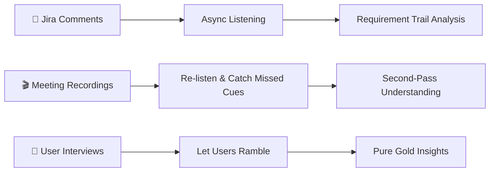
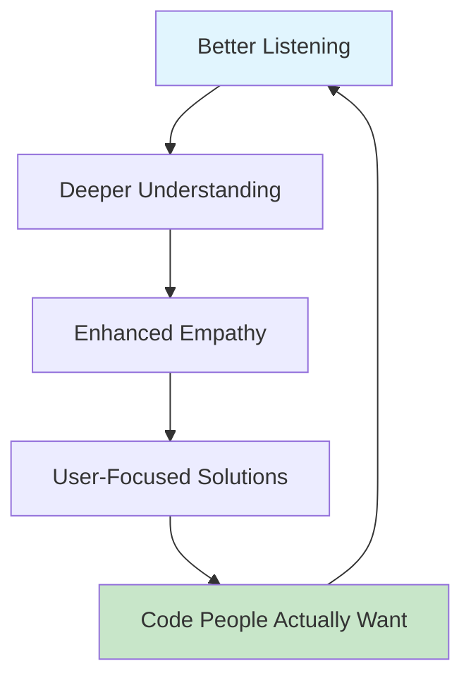

# 🧠 **Honestly? Why Your Code Will Suck Without Listening Skills**

> *Here's the thing nobody tells you in coding bootcamps—your brilliant algorithms mean jack if you're building the wrong thing.*

---

## 🎯 **The Four Pillars of Developer Listening**

| **Listening Type** | **What It Actually Means** | **When You Need It** | **Reality Check** |
|-------------------|---------------------------|---------------------|-------------------|
| 🎤 **Active** | Engaging, paraphrasing, asking follow-ups | Requirement gathering, sprint planning | *Exhausting but necessary* |
| 🪞 **Reflective** | Tuning into emotional undertones | User feedback sessions, conflict resolution | *"The system is fine, I guess" = NOT FINE* |
| 🔍 **Critical** | Filtering signal from noise | Feature prioritization, scope discussions | *17 feature requests ≠ 17 actual needs* |
| ❤️ **Empathic** | Understanding non-tech perspectives | Cross-team collaboration, user interviews | *They don't think in user stories like we do* |

---

## ⚡ **Hearing vs. Listening: The Brutal Truth**

### 👂 **HEARING** (The Bad Kind)
```
┌─────────────────────────────────────┐
│ • Mental debugging while "listening" │
│ • Catching words, missing context    │
│ • Nodding at appropriate intervals   │
│ • Building what was "said"          │
└─────────────────────────────────────┘
```

### 🎧 **LISTENING** (The Good Stuff)
```
┌─────────────────────────────────────┐
│ • Understanding domain logic         │
│ • Catching political undercurrents   │
│ • Grasping constraints & motivations │
│ • Building what's actually needed    │
└─────────────────────────────────────┘
```

---

## 💥 **When Bad Listening Ruins Everything**

| **The Scenario** | **The Disaster** | **The Aftermath** |
|------------------|------------------|-------------------|
| 🎯 Misinterpret feature request | Wrong implementation | 🔥 Entire sprint wasted |
| 🙉 Ignore UAT feedback | Low adoption | 📉 Beautiful code nobody uses |
| 🤷 Skip clarification on vague requirements | Developer frustration | 🕳️ Technical debt nightmare |
| 😶 Miss stakeholder emotions | Misaligned priorities | ⚔️ Business vs. Dev conflicts |

---

## 🏃‍♂️ **Agile Ceremonies: Your Listening Opportunities**

### 📅 **Daily Stand-ups**
- **Listen for:** `Blockers hidden between the lines`
- **Red flags:** *"Everything's fine"* (in a defeated tone)
- **Pro tip:** 👁️ Watch body language, not just words

### 📋 **Sprint Planning** 
- **Listen for:** `What's NOT being said`
- **Hidden gems:** Edge cases, risks, assumptions
- **Strategy:** 🤔 Ask "What could go wrong?"

### 🔄 **Retrospectives**
- **Listen for:** `Emotional signals in team feedback`
- **Watch out for:** Team dynamics, burnout signs
- **Focus:** 💬 Communication failures, not just technical debt

### 🎫 **Backlog Grooming**
- **Listen for:** `Unclear ticket descriptions`
- **Decode:** Business language → Technical requirements
- **Goal:** 🎯 Understanding the "why" behind features

---

## 🛠️ **Tactical Listening Arsenal**

### ✅ **The Essential Techniques**

| **Technique** | **How It Works** | **When to Use** | **Pro Tip** |
|---------------|------------------|-----------------|-------------|
| 📝 **Note-Taking** | Internalize + double-check later | All meetings | *Shows you're paying attention* |
| ❓ **Clarifying Questions** | "When you say X, do you mean Y?" | Requirement confusion | *Never feel stupid asking* |
| 🔁 **Repeating Back** | "So what I'm gathering is..." | After complex explanations | *Feels awkward but catches errors* |
| ⏸️ **Delay Judgment** | Don't jump to solutions immediately | Problem definition phase | *Real problem ≠ first description* |
| 🗣️ **Mirroring Language** | Use their terminology | Building trust | *Speaks their language literally* |

---

## 🔧 **Tools That Don't Suck**



---

## 🌉 **The Business-Code Translation Bridge**

### Before Good Listening:
```
Business Request → ??? → Code Implementation
                  (Black Box of Confusion)
```

### After Good Listening:
```
Business Need → Understanding → User Value → Code Implementation
             ↑                           ↑
    (Ask Why)                    (Validate)
```

---

## 💀 **Real Horror Stories** *(Names Changed to Protect the Guilty)*

### 🏦 **Case Study 1: The Fintech Fail**

| **What They Said** | **What We Built** | **What They Actually Needed** | **The Problem** |
|-------------------|-------------------|-------------------------------|-----------------|
| "Transaction limit alerts" | 📧 Email notifications | 📱 Real-time push notifications | Heard *feature*, missed *urgency* |

**💡 Lesson:** *Users were trying to prevent fraud, not clean up after it*

---

### 🏛️ **Case Study 2: The Government Site Disaster**

| **Requirement** | **Our Implementation** | **User Reality** | **The Gap** |
|-----------------|----------------------|------------------|-------------|
| "Accessibility compliance" | ✅ Passed technical requirements | 🚫 Screen readers still couldn't navigate | Compliance ≠ Usability |

**💡 Lesson:** *We built for auditors, not actual users*

---

## 🏋️‍♂️ **Building Better Listening Muscles**

### 🎯 **Training Exercises That Actually Work**

```
┌─ BEGINNER ─────────────────────────┐
│ • Mock stakeholder interviews      │
│ • Practice paraphrasing exercises  │
│ • Record yourself in meetings      │
└────────────────────────────────────┘

┌─ INTERMEDIATE ─────────────────────┐
│ • Live usability debriefs         │
│ • Cross-functional shadowing      │
│ • Customer support call listening │
└────────────────────────────────────┘

┌─ ADVANCED ─────────────────────────┐
│ • Facilitate requirement sessions │
│ • Lead discovery workshops        │
│ • Mentor junior devs on listening │
└────────────────────────────────────┘
```

---

## ❤️ **The Empathy Connection**

> **The Bottom Line:** *Your code is only as good as your understanding of the problem you're solving.*

### 🔄 **The Listening → Empathy → Better Code Cycle**



---

## 🎯 **Key Takeaways**

| **Remember This** | **Not This** |
|-------------------|--------------|
| 🎧 Listen for the "why" behind requests | 👂 Just collect feature lists |
| 🤝 Understand stakeholder emotions | 🤖 Focus only on technical specs |
| 🔍 Question vague requirements early | 🤷 Assume you'll figure it out later |
| 💬 Use their language to build trust | 🎓 Show off with technical jargon |
| ❤️ Develop empathy for end users | 💻 Build for other developers |

---

**🚀 Final Reality Check:** *In a world full of technically perfect but utterly useless applications, listening skills are your real competitive advantage.*
